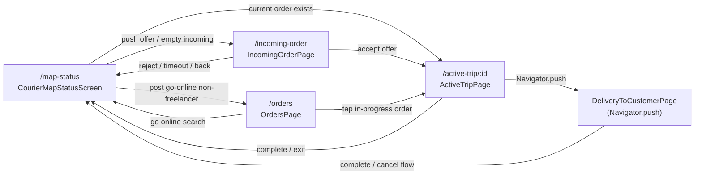

# File Ownership Map — Gaseel Courier

**Phase:** 1 (foundations — documentation only)  
**Last updated:** June 7, 2026  
**Purpose:** Single source of truth for mega-screen ownership before safe refactoring.

---

## 1. Mega Screen Ownership

### 1.1 `delivery_to_customer_page.dart`

| Attribute | Detail |
|-----------|--------|
| **Current path** | `lib/features/delivery/delivery_to_customer_page.dart` |
| **Approx. lines** | ~1,715 |
| **In go_router?** | No — opened via imperative `Navigator.push` from active trip only |

**Main responsibilities**

- Delivery and pickup confirmation UI (multi-step: clothes, building photos, customer info)
- Proof photo capture via camera (`ImagePicker`)
- Attempted delivery checklist dialog and submission
- Customer call / chat launch
- Orchestrates completion via Cubits (upload proof, update rider status)
- Navigation back to map-status on success

**State variables (owned by `_DeliveryToCustomerPageState`)**

| Variable | Purpose |
|----------|---------|
| `_buildingPhotos`, `_orderPhotos` | Local photo lists (`List<XFile>`) |
| `_picker` | `ImagePicker` instance |
| `_deliveryCompletionCubit`, `_attemptedDeliveryChecklistCubit` | Created via `getIt` in `initState`, closed in `dispose` |
| `_isPickupSubmitting` | Local guard for pickup confirm path |
| `_maxRequiredBuildingPhotos = 4` | Business rule constant |

**Cubits used**

- `DeliveryCompletionCubit` — deliver / attempt delivery (upload + rider status)
- `AttemptedDeliveryChecklistCubit` — load/submit checklist

**Use cases called directly from UI**

- None — all API access goes through Cubits above

**Timers / streams / subscriptions**

- None (no `Timer`, no `StreamSubscription`)
- `ImagePicker` async only

**Navigation**

| Direction | Mechanism | Target |
|-----------|-----------|--------|
| **In** | `Navigator.push` / `PageRouteBuilder` | From `active_trip_page.dart` only |
| **Out** | `context.go('/map-status')` | After delivery/pickup complete |
| **Out** | `Navigator.push` | `CustomerChatScreen` |
| **Out** | `Navigator.pop` | Dialogs, chat back |

**Related API endpoints** (via Cubits → use cases → `ApiConstants`)

- `POST .../orders/{id}/proof-photo`
- `PUT .../orders/{id}/delivery-status` (rider status 6 deliver, 7 attempted)
- `GET .../api/mobile/orders/{id}/checklist` ⚠ non-v1
- `POST .../api/mobile/orders/{id}/checklist` ⚠ non-v1

**High-risk areas**

- Photo upload + rider status sequence in `DeliveryCompletionCubit`
- Checklist dialog state tied to `AttemptedDeliveryChecklistCubit`
- Pickup vs delivery branching (`widget.isPickup`, `requireProofPhoto`)
- Cubits registered as factory in get_it — **must close in dispose**

**Do not change in early phases (Phases 1–3)**

- Cubit method call order and rider status integers (6, 7)
- `Navigator.push` entry from active trip (not routed)
- Photo validation rules (`_canDeliver`, max 4 building photos)
- `context.go('/map-status')` exit paths

---

### 1.2 `courier_map_status_screen.dart`

| Attribute | Detail |
|-----------|--------|
| **Current path** | `lib/screens/courier_map_status_screen.dart` |
| **Approx. lines** | ~1,270 |
| **Route** | `/map-status` (`CourierMapStatusScreen.id`) |
| **Route extras** | `{'autoSearch': true}` triggers auto go-online |

**Main responsibilities**

- Post-login **hub screen**: full-screen Google Map + courier marker
- Go online / go offline toggle (drawer + FAB)
- Heartbeat integration after successful go-online
- Poll / display current offer (freelancer banner loop)
- Resolve current order vs offer → navigate to incoming or active trip
- Profile drawer, settings, orders, notifications shortcuts
- GPS initialization and map centering

**State variables**

| Variable | Purpose |
|----------|---------|
| `_scaffoldKey` | Drawer |
| `_mapController` | `GoogleMapController` |
| `_profileName` | Display name from profile |
| `_courierOnline` | UI + persisted online flag |
| `_kCourierOnlineKey = 'courier_online'` | SharedPreferences key (duplicated elsewhere) |
| `_currentPosition`, `_locationLoading` | GPS |
| `_courierMarkerIcon`, `_courierMarkerIconLoading` | Map marker asset |
| `_fakeOfferBannerTimer`, `_fakeOfferBannerHideTimer` | Offer banner timing |
| `_offerLookupInFlight`, `_openingOfferFlow` | Concurrency guards |
| `_fakeOfferBannerVisible` | Banner UI state |
| `_cachedCourierTypeId` | Branching (freelancer = 1) |

**Cubits used** (provided by router + app root)

- `GoOnlineCubit` — go online API
- `GoOfflineCubit` — go offline API
- `HeartbeatCubit` — start/stop heartbeat (app-level + listeners here)

**Use cases called directly from UI**

- `GetCurrentOrderUseCase` — current order fallback
- `GetCurrentOfferUseCase` — offer polling / navigation decisions

**Data sources (non-use-case)**

- `CourierProfileLocalDataSource` — cached `courierTypeId`

**Timers / streams / subscriptions**

| Resource | Purpose |
|----------|---------|
| `_fakeOfferBannerTimer` | `Timer.periodic` — offer banner loop (freelancer) |
| `_fakeOfferBannerHideTimer` | Auto-hide banner |
| `GoogleMapController` | Map lifecycle |
| `Geolocator` | Location permission + position (no continuous stream in this file) |

**Navigation**

| Direction | Target |
|-----------|--------|
| **In** | Redirect after onboarding; `permissions_page`, `location_setup_page`, `orders_page` |
| **Out** | `context.push('/incoming-order', extra: ...)` |
| **Out** | `context.go('/active-trip/{id}', extra: OrderMock / Map)` |
| **Out** | `context.go('/orders')` — post go-online (non-freelancer path) |
| **Out** | `context.push('/home/profile')`, `/notifications`, `/home/settings` |
| **Out** | `context.go('/login')` on logout |

**Related API endpoints**

- `GET .../api/v1/mobile/orders/current`
- `GET .../api/v1/mobile/orders/offers/current`
- `POST .../api/driver-availability/go-online`
- `POST .../api/driver-availability/go-offline`
- `POST .../api/driver-availability/heartbeat`
- `GET .../api/courier/me` (indirect via profile load)

**High-risk areas**

- `BlocListener<GoOnlineCubit>` → heartbeat start → `_handlePostGoOnlineNavigation`
- Direct use case calls bypassing a dedicated Cubit
- Fake offer banner timers + freelancer `courierTypeId == 1` branch
- `'courier_online'` persistence sync with `HeartbeatCubit.courierOnlineKey`
- **Default post-login redirect** in `app_router.dart` points here

**Do not change in early phases**

- `app_router.dart` redirect to `/map-status`
- Go online / offline / heartbeat listener sequence
- Offer vs current-order navigation priority
- SharedPreferences key `'courier_online'`
- Timer intervals for offer banner

---

### 1.3 `incoming_order_page.dart`

| Attribute | Detail |
|-----------|--------|
| **Current path** | `lib/features/incoming/presentation/pages/incoming_order_page.dart` |
| **Approx. lines** | ~1,545 |
| **Route** | `/incoming-order` (`IncomingOrderPage.id`) |
| **Route extras** | `IncomingOrderRouteArgs` or raw `OrderMock` |

**Main responsibilities**

- Incoming offer UI: map, route curve, stop cards, earnings, countdown
- Accept / reject offer (via `IncomingOrderCubit`)
- Drawer (profile, settings, orders, logout)
- Freelancer vs full-time flow branching
- Alert sound on entry when offer present
- Navigate to active trip on accept

**State variables**

| Variable | Purpose |
|----------|---------|
| `_scaffoldKey`, `_mapController` | UI / map |
| `_profilePhoto` | Drawer avatar |
| `_labelOffsets`, `_labelsReady`, `_labelData`, `_mapWidth`, `_mapHeight` | Map label overlay |
| `_cameraMoveDebounce` | Map camera debounce timer |
| `_remainingSeconds`, `_countdownTimer` | Offer countdown |
| `_courierOnline`, `_kCourierOnlineKey` | Online display (read-only here) |
| `_expiredNavigated`, `_didStartEntryAlert`, `_isRejectSubmitting` | Flow guards |
| `_initialBounds`, `_userMovedMap`, `_didInitialFit`, etc. | Map fit behavior |

**Cubits used**

- `IncomingOrderCubit` — provided by router; load/accept/reject/update status

**Use cases called directly from UI**

- None — delegated to `IncomingOrderCubit`

**Timers / streams / subscriptions**

| Resource | Purpose |
|----------|---------|
| `_countdownTimer` | `Timer.periodic` 1s — offer expiry |
| `_cameraMoveDebounce` | Debounce map label updates |
| `GoogleMapController` | Map |
| `AlertSoundService` | One-shot entry alert |

**Navigation**

| Direction | Target |
|-----------|--------|
| **In** | `courier_map_status_screen.dart` → `push('/incoming-order')` |
| **Out** | `context.go('/active-trip/{id}', extra: order)` on accept |
| **Out** | `context.go('/map-status')` on reject / expire / back |
| **Out** | `context.push('/incoming-order/map')` full map |
| **Out** | `/home/settings`, `/home/profile`, `/notifications`, `/orders`, `/login` |

**Related API endpoints** (via `IncomingOrderCubit`)

- `GET .../api/v1/mobile/orders/offers/current`
- `GET .../api/v1/mobile/orders/current`
- `POST .../offers/{id}/accept`
- `POST .../offers/{id}/reject`
- `PUT .../orders/{id}/delivery-status`
- `PUT .../orders/{id}/pickup-status`

**High-risk areas**

- Countdown expiry → navigation (`_expiredNavigated`)
- Accept path: delivery vs pickup (`acceptDeliveryOrder` / `acceptPickupOrder`)
- `OrderMock` in cubit state and navigation extras
- Map label positioning (RTL-sensitive)
- BlocConsumer listener starting countdown when offer seconds arrive from cubit

**Do not change in early phases**

- `IncomingOrderCubit` public methods and accept/reject API order
- Countdown duration logic tied to `initialOffer.remainingSeconds`
- Navigation extras shape (`OrderMock`)
- Route path `/incoming-order`

---

### 1.4 `active_trip_page.dart`

| Attribute | Detail |
|-----------|--------|
| **Current path** | `lib/features/trip/presentation/pages/active_trip_page.dart` |
| **Approx. lines** | ~2,066 |
| **Route** | `/active-trip/:id` |
| **Route extras** | `OrderMock`, or `Map` with `order`, `entrySource` |

**Main responsibilities**

- Active order trip: map, polylines, GPS tracking, labeled markers
- Delivery vs pickup status state machine (rider + pickup integers)
- Load/refresh order (`GetCurrentOrderUseCase`)
- Update rider status (`UpdateRiderStatusUseCase`)
- Pickup subflow via `PickupStatusCubit`
- Open `DeliveryToCustomerPage` for confirmation
- Complaint drawer, order details sheet, chat, full-map sub-route

**State variables**

| Variable | Purpose |
|----------|---------|
| `_order`, `_loading` | Order display model (`OrderMock`) |
| `_mapController`, `_currentPosition` | Map + GPS |
| `_routePolyline`, `_directionsService` | Route display |
| `_positionSubscription` | **Continuous GPS stream** |
| `_labelOffsets`, `_labelData`, map dimensions | Label overlays |
| `_deliveryRiderStatus`, `_pickupRiderStatus` | Status integers |
| `_cachedCourierTypeId`, full-time flags | Courier type branching |
| `_isUpdatingRiderStatus`, `_openedDeliveryConfirmationPage`, etc. | Transition guards |
| `_pickupStatusCubit` | Pickup photo + pickup status API |

**Cubits used**

- `PickupStatusCubit` — pickup proof upload + pickup status updates

**Use cases called directly from UI**

- `GetCurrentOrderUseCase`
- `UpdateRiderStatusUseCase`

**Data sources**

- `CourierProfileLocalDataSource` — `courierTypeId`

**Timers / streams / subscriptions**

| Resource | Purpose |
|----------|---------|
| `_positionSubscription` | `Geolocator.getPositionStream` — **critical** |
| `GoogleMapController` | Map |
| `DirectionsService` | HTTP directions (not Dio) |

**Navigation**

| Direction | Target |
|-----------|--------|
| **In** | map-status, incoming (accept), orders list, router |
| **Out** | `Navigator.push` → `DeliveryToCustomerPage` |
| **Out** | `context.go('/map-status')` or `/orders` (via `entrySource`) |
| **Out** | `context.push('/active-trip/{id}/map')` |
| **Out** | `CustomerChatScreen`, complaint drawer (modal) |

**Related API endpoints**

- `GET .../api/v1/mobile/orders/current`
- `PUT .../orders/{id}/delivery-status`
- `PUT .../orders/{id}/pickup-status`
- `POST .../orders/{id}/proof-photo` (via PickupStatusCubit / delivery page)

**High-risk areas**

- Rider/pickup status integer state machine (largest logic concentration)
- GPS stream lifecycle (`dispose` must cancel subscription)
- Direct use case calls + `OrderMock` mapping from API
- `DeliveryToCustomerPage` push arguments (pickup vs delivery)
- Full-time courier (`courierTypeId == 3`) initial step flags

**Do not change in early phases**

- Status integer constants (see `BusinessConstants` mirror)
- GPS stream setup/teardown
- `GetCurrentOrderUseCase` / `UpdateRiderStatusUseCase` call timing
- `Navigator.push` to delivery page
- `entrySource` routing to `/orders` vs `/map-status`

---

## 2. Navigation Graph (Operational Core)

**Additional edges (not in diagram)**

- `/permissions` → `/map-status` after onboarding
- `/location-setup` → `/map-status`
- `/active-trip/:id/map` — full map sub-routes from trip and incoming

---

## 3. SharedPreferences / Storage Key Ownership

### 3.1 Login / session (`SharedPrefKeys` + secure storage)

| Key | Owner / writers | Readers |
|-----|-----------------|---------|
| `userToken` | LoginCubit, SignUpPhoneNumberCubit, AuthTokenInterceptor | AuthTokenInterceptor |
| `refreshToken` | Same | AuthTokenInterceptor, logout |
| `authUserId`, `authUserName`, `authPhoneNumber` | Login, signup, token refresh | Profile, display |
| `authIsActive`, `authIsRejected`, `authIsPhoneVerified` | Login, signup | — |
| `authExpiresInMinutes` | Login, token refresh | — |
| `cachedDetectedPhoneIsoCode` | Splash, login, signup, forget password | Phone fields |

**Logout clears:** `AuthService.logout()` — see `core/auth/auth_service.dart`

### 3.2 Onboarding (`OnboardingState`)

| Key | Purpose |
|-----|---------|
| `isLoggedIn` | Router gate |
| `permissionsGranted` | Router gate |
| `locationServiceEnabled` | Router gate |
| `profileCompleted`, `documentsSubmitted`, `reviewApproved` | Signup flow flags |
| `welcomeEntered` | Welcome vs login redirect |

Also: `SharedPrefKeys.splashCompleted`, `locationPermissionPromptHandled` (splash)

### 3.3 Courier operational

| Key | Owner | Notes |
|-----|-------|-------|
| `'courier_online'` | map-status, orders, incoming (read), HeartbeatCubit | **Duplicated constant** — do not consolidate in Phase 1 |
| `SharedPrefKeys.courierTypeId` | CourierProfileLocalDataSource / Cubit | Drives freelancer vs full-time branching |

### 3.4 Firebase / push

| Key | Owner |
|-----|-------|
| `firebaseFcmToken` | FcmTokenService |
| `lastPushNotificationEvent`, `pendingBackgroundNotificationEvent` | PushNotificationService |

### 3.5 Locale / theme

| Key | Owner |
|-----|-------|
| `'locale'` (LocaleController / locale_helper) | Settings |
| Theme mode key | ThemeController |

---

## 4. Legacy File Registry

| File / area | Status | Notes |
|-------------|--------|-------|
| `features/onboarding/presentation/pages/sign_up_page.dart` | **KEEP for now** | DO NOT DELETE until Phase 6 — duplicates auth signup |
| `features/onboarding/presentation/pages/otp_verification_page.dart` | **KEEP for now** | DO NOT DELETE until Phase 6 |
| `features/onboarding/presentation/pages/document_upload_page.dart` | **KEEP for now** | DO NOT DELETE until Phase 6 — auth has parallel page |
| `features/onboarding/presentation/pages/documents_review_page.dart` | **KEEP for now** | DO NOT DELETE until Phase 6 |
| `features/onboarding/presentation/pages/awaiting_review_page.dart` | **KEEP for now** | Routed via `/signup/awaiting-review` (auth path) — verify which page router uses |
| `features/onboarding/presentation/pages/permissions_page.dart` | **KEEP — ACTIVE** | Routed at `/permissions` — **not legacy for routing** |
| `features/onboarding/presentation/pages/location_setup_page.dart` | **KEEP — ACTIVE** | Routed at `/location-setup` |
| `features/permission/presentation/pages/permission_page.dart` | **KEEP for now** | DO NOT DELETE until Phase 6 — `/permission` redirects to `/permissions` |
| `features/auth/presentation/pages/login_page.dart` (commented) | **KEEP for now** | DO NOT DELETE until Phase 6 — Needs grep verification before deletion |
| `features/auth/login/presentation/pages/login_screen.dart` (commented) | **KEEP for now** | DO NOT DELETE until Phase 6 — Needs grep verification before deletion |
| `features/orders/data/repositories/mock_orders_repository.dart` | **KEEP for now** | DO NOT DELETE until Phase 6 — Needs grep verification before deletion |
| `features/orders/data/mock_orders_data.dart` | **KEEP for now** | DO NOT DELETE until Phase 6 |
| `features/orders/domain/repositories/orders_repository.dart` | **KEEP for now** | Legacy interface — Needs grep verification before deletion |
| `core/orders/mock_order_matcher.dart` | **KEEP for now** | DO NOT DELETE until Phase 6 |
| `features/orders/domain/models/order_mock.dart` | **KEEP — PRODUCTION** | Used in navigation and UI — **not deletable until dedicated migration** |
| All `OrderMock` consumers (26+ files) | **KEEP for now** | DO NOT DELETE until Phase 6 OrderMock migration |
| `core/locale/core_translations_data.dart` | **KEEP for now** | GetX parallel l10n — DO NOT DELETE until Phase 6 localization migration |
| `core/locale/app_translations.dart` | **KEEP — ACTIVE** | Used by `GetMaterialApp` |
| `core/locale/legacy_l10n_proxy.dart` | **KEEP for now** | DO NOT DELETE until Phase 6 |
| `lib/screens/courier_map_status_screen.dart` | **KEEP — ACTIVE** | Move planned Phase 5 only |

**Deletion gate (all items):** zero imports + zero route refs + full QA — see Phase 6 in execution plan.

---

## 5. Open Questions

1. **Checklist API path version** — Checklist uses `/api/mobile/orders/{id}/checklist` while other order endpoints use `/api/v1/mobile/orders`. Is this intentional on the backend?

2. **OrderMock vs MobileOrder** — Production flow maps API `MobileOrder` → `OrderMock` for UI/navigation. When is full migration safe? Who owns the mapper contract?

3. **Duplicate onboarding vs auth** — Several onboarding pages mirror auth signup. Which are still reachable outside router? Need grep + manual path audit before Phase 6 deletion.

4. **Triple localization** — ARB (`AppLocalizations`), GetX (`CoreTranslationsData`), and duplicated `_resolveL10n`. Which strings are authoritative per screen?

5. **`courier_online` key duplication** — Same string in 4+ places. Consolidation risks desync with HeartbeatCubit — needs dedicated phase with QA.

6. **`AwaitingReviewPage` import** — Router imports from `features/onboarding/.../awaiting_review_page.dart` under signup nested route — confirm not duplicated with auth-only path.

7. **Freelancer `courierTypeId == 1`** — Hardcoded in map-status; confirm with backend if type IDs are stable.

---

## 6. Phase 1 Foundation Files (additive, unwired)

| File | Purpose |
|------|---------|
| `lib/core/router/route_paths.dart` | Route string constants |
| `lib/core/constants/business_constants.dart` | Shared business ints/keys |
| `lib/core/theme/app_colors.dart` | Color constants |
| `lib/core/locale/l10n_context_extension.dart` | Future `_resolveL10n` replacement |

**Not wired in Phase 1** — existing inline strings and helpers remain authoritative.

---

*Maintained as part of safe refactoring program. Update when file moves or ownership changes.*
